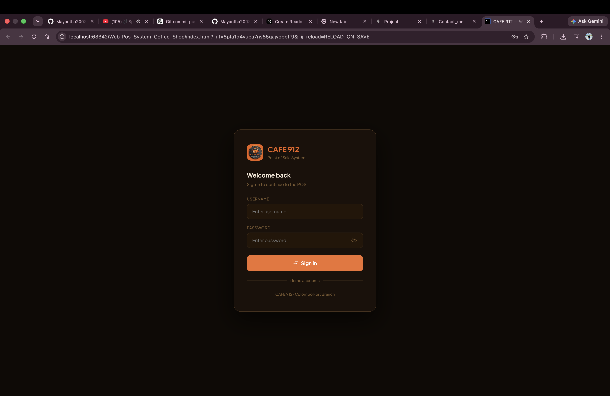
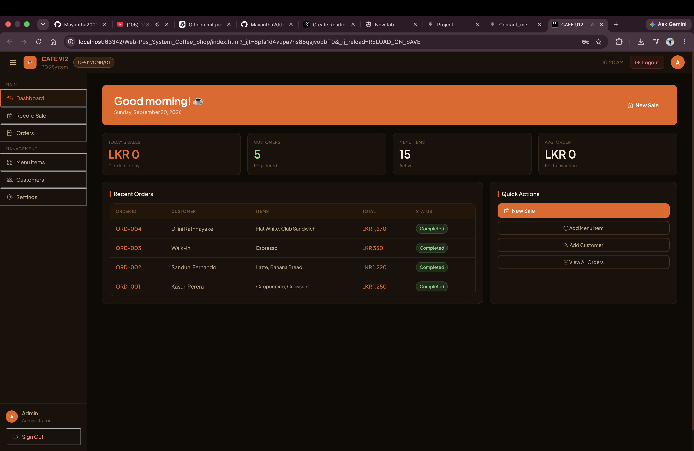
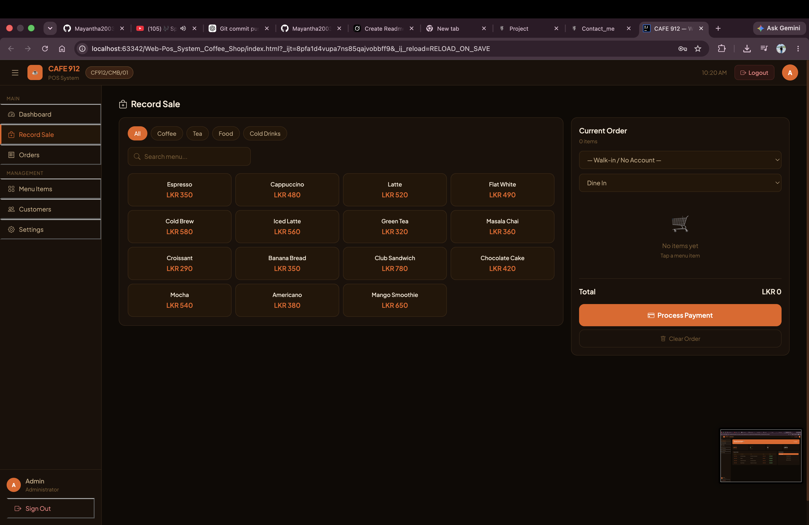
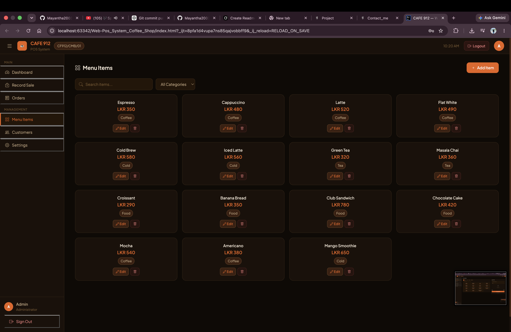
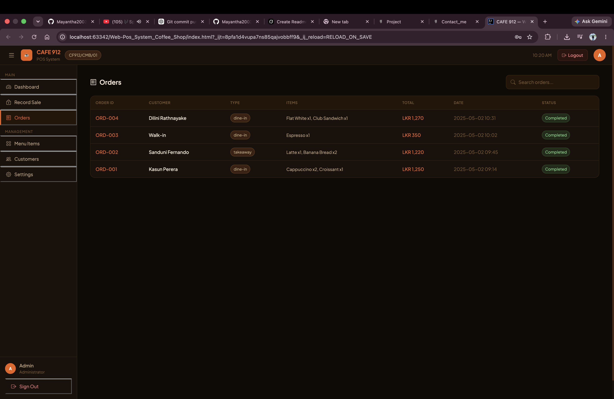

# CAFE 912 – Web POS System (Coffee Shop)

A browser-based **Point of Sale (POS)** system designed for a coffee shop (**CAFE 912**).  
Built with **HTML, CSS, and vanilla JavaScript** using an MVC-style structure (Model · View · Controller). Data is stored in the browser (in-memory / local storage style DB layer).

---

## Features

- **Login** – Secure sign-in for staff/admin
- **Dashboard** – Today’s sales, customers, menu items, average order, recent orders, quick actions
- **Record Sale** – Menu grid by category (Coffee, Tea, Food, Cold Drinks), cart, dine-in / takeaway, process payment
- **Orders** – View all orders with status, customer, items, total, date
- **Menu Items** – Add / edit / delete products with prices and categories
- **Customers** – Customer management
- **Settings** – System settings

---

## Screenshots

### Login


### Dashboard


### Record Sale


### Menu Items


### Orders


---

## Tech Stack

| Layer | Technology |
|-------|------------|
| Frontend | HTML5, CSS3, JavaScript (ES6) |
| Architecture | MVC (Model · Controller · View) |
| Data | Client-side DB module (`db/db.js`) |
| UI | Custom dark theme (orange accent) |

---

## Project Structure

```
Web-Pos_System_Coffee_Shop/
├── index.html                 # Main app shell / entry
├── controller/
│   ├── LoginController.js
│   ├── SaleController.js
│   ├── OrderController.js
│   ├── CustomerController.js
│   └── ...
├── model/
│   ├── LoginModel.js
│   ├── OrderModel.js
│   ├── ItemModel.js
│   ├── CustomerModel.js
│   └── Settingsmodel.js
├── db/
│   └── db.js                  # In-memory / local data store
├── assets/
│   ├── styles/
│   ├── lib/
│   └── photo/
└── README.md
```

---

## How to Run

```bash
# Open with Live Server or any static file server
# Example (VS Code Live Server / IntelliJ):
# Right-click index.html → Open in Browser / Live Server
```

Or simply open `index.html` in Chrome / Edge / Firefox.

---

## Demo Login

Use the demo account shown on the login screen (CAFE 912 – Colombo Fort Branch), or check credentials defined in `model/LoginModel.js` / `db/db.js`.

---

## Sample Menu Categories

- **Coffee** – Espresso, Cappuccino, Latte, Flat White, Mocha, Americano, Cold Brew, Iced Latte  
- **Tea** – Green Tea, Masala Chai  
- **Food** – Croissant, Banana Bread, Club Sandwich, Chocolate Cake  
- **Cold Drinks** – Mango Smoothie, etc.

---

## Author

**G. D. Mayantha (Mayantha Sithum Kaveesha)**  
GitHub: [Mayantha2003](https://github.com/Mayantha2003)

---

## License

Educational / portfolio project.
